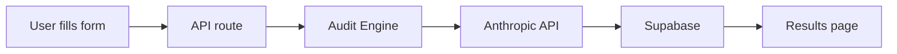

# Architecture

SpendLens will start as a simple App Router product with one audit flow and a saved result view.

## Stack Justification

- Next.js 14 with App Router: production-ready React framework with first-class routing and Vercel deployment.
- TypeScript strict mode: catches shape mismatches early across the audit flow.
- Tailwind CSS: fast utility styling without committing to a large design system too early.
- Supabase: hosted Postgres and auth-ready storage for leads and audits later.
- Vercel: natural deployment target for Next.js apps.
- Shadcn/ui: copy-in component foundation when the product needs polished controls.
- Vitest: fast test runner for the audit engine and future UI behavior.

## What Would Change At 10k Audits/Day

TODO
