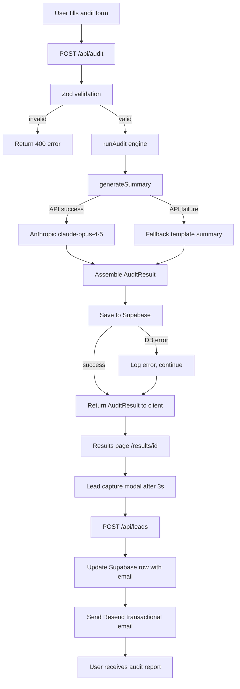

# Architecture

## System diagram

## Data flow

The user enters their team size, use case, tools, seats, plans, and monthly spend on `/audit`, then the form posts that payload to `/api/audit`. The API validates the input with Zod, runs `runAudit()` to calculate plan-fit issues and savings opportunities, and then asks Anthropic for a short personalized summary. If Anthropic is unavailable, the API falls back to a templated summary, saves the audit result in Supabase, and returns the completed `AuditResult` to the browser. The client navigates to `/results/[id]`, shows the savings breakdown immediately, then opens a lead-capture modal after three seconds; if the user submits an email, `/api/leads` updates the Supabase row and triggers a Resend email with a link back to the audit.

## Stack justification

- Next.js 14 App Router:
  I chose Next.js over Remix because SpendLens needed API routes, server-rendered metadata, and client-only interactive islands in one project with very little setup. Remix would also have worked, but Next.js fit the Vercel deployment model better and made the `/api/*` routes, results page metadata, and hybrid server/client UI easier to organize quickly.

- TypeScript strict mode:
  Strict TypeScript was important because the same audit result shape moves through the form, API routes, audit engine, Supabase, and results page. The obvious alternative was looser typing or JavaScript, but that would make it much easier to accidentally mix up savings fields or return malformed recommendations.

- Tailwind CSS:
  I chose Tailwind over CSS modules because the app needed a lot of form, card, modal, and results-page styling in a short time. CSS modules would have been fine for a larger design system, but Tailwind let me move faster while keeping responsive and state-based styling close to the JSX.

- Supabase:
  I chose Supabase over Firebase because the audit data is naturally relational and mixes structured columns with JSONB fields like tools and recommendations. Firebase would be workable for document storage, but Supabase gave me Postgres, SQL migrations, and a cleaner fit for querying audits and leads later.

- Resend:
  I chose Resend over SendGrid because the MVP only needs simple transactional email, not a full marketing email platform. Resend has a smaller API surface and a cleaner developer experience, while SendGrid would be heavier than necessary for one "your audit is ready" email flow.

- Anthropic API:
  I used Anthropic only for the summary layer, not the savings math, because the audit logic needs to stay deterministic and defensible. The alternative would have been generating recommendations with AI directly, but that would make the numbers harder to trust and test.

- Vercel:
  I chose Vercel because it is the most natural deployment target for a Next.js App Router project and handles HTTPS, environment variables, and serverless API routes with minimal friction. A self-managed alternative would have added infrastructure work that did not help validate the product.

- Vitest:
  I chose Vitest over Jest because the audit engine is pure TypeScript logic and benefits more from fast local runs than a heavier test runner setup. Jest would have worked, but Vitest was quicker to configure and better matched the small, logic-focused test suite.

## What would change at 10k audits per day

At 10k audits per day, the biggest architectural weakness in the current build is the in-memory rate limiter inside the API routes. Right now each route stores request counts in a local `Map`, which is acceptable for a small MVP but breaks across serverless instances because separate Vercel functions do not share memory. At scale, that would need Redis or a similar shared store so limits are enforced consistently no matter which instance handles the request.

Supabase would also need a more serious production setup. The free tier is fine for an MVP, but 10k audits per day plus lead updates and results lookups would push row volume, bandwidth, and concurrent connections much harder. I would move to a paid plan, review indexes against real query patterns, and add connection pooling through PgBouncer or Supabase's built-in pooling so serverless bursts do not overwhelm Postgres connections.

Anthropic latency would become another bottleneck. The current `/api/audit` route waits for `generateSummary()` before returning the result, which is simple but means the user's response time is tied to a third-party model call. At higher volume I would queue summary generation in the background, return the deterministic audit result immediately, and update the stored audit once the summary finishes.

The base64 query-param handoff would also stop being a good long-term approach. It works for the immediate post-audit redirect, but larger payloads and longer summaries will eventually run into URL length limits and make sharing fragile. At scale, I would render `/results/[id]` directly from Supabase on the server and treat the query payload only as a temporary convenience.
